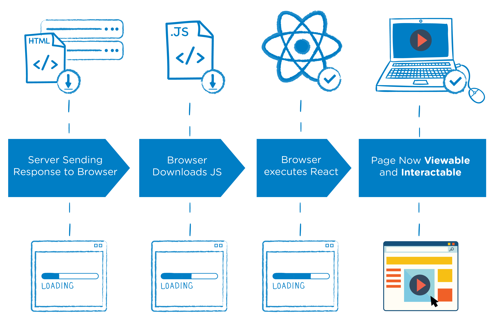

## Serverside Rendering 
### with React


Stefan Schwartze
---


### Hi, I am Stefan 👋

<!-- .element: class="small-stefan" -->
👉 Developer at Sevenval
  <!-- .element: class="fragment" -->
🗺 Berlin Office
<!-- .element: class="fragment" -->
❤️ I like **JavaScript**
<!-- .element: class="fragment" -->
Note:
* I mostly work on frontends, sometimes also on backends
* JavaScript is my preference because it runs almost anywhere
* Today I talk about some rendering on the web
---

 **+** 
<!-- .element: class="aligned-items" -->
Note:
* A friend sent you a link to an interesting article
* You're taking the train outside the city
----

<div class="css-iphone">
  <div class="iphone-body">
      <div class="iphone-screen-position">
         <div class="iphone-home-button"></div>
         <div class="iphone-screen">
            
         </div>
      </div>
  </div>
</div>
Note:
* Low network connection
* The loading indicator comes early, the interactivity really late
* Site appears when user is already frustrated or gone
---


### What has happened?
Note:
* JS has responsibility to render
---

**CSR**: **C**lient-**S**ide **R**endering - rendering an app in a browser, generally using JavaScript.
<!-- .element: class="" -->

<!-- .element: class="small-logo" -->
Note:
* Website is developed with JavaScript (React)
* Client-side rendering (CSR) means rendering pages directly in the browser using JavaScript. All logic, data fetching, templating and routing are handled on the client rather than the server.
----

<!-- .slide: data-transition="slide-in" -->

<!-- .element: class="stretch" -->
Source: [Alex Grigoryan](https://medium.com/walmartlabs/the-benefits-of-server-side-rendering-over-client-side-rendering-5d07ff2cefe8)
<!-- .element: class="small-link" -->
----

<!-- .slide: data-transition="none" -->

<!-- .element: class="stretch" -->
Source: [Alex Grigoryan](https://medium.com/walmartlabs/the-benefits-of-server-side-rendering-over-client-side-rendering-5d07ff2cefe8)
<!-- .element: class="small-link" -->
----

<!-- .slide: data-transition="none" -->

<!-- .element: class="stretch" -->
Source: [Alex Grigoryan](https://medium.com/walmartlabs/the-benefits-of-server-side-rendering-over-client-side-rendering-5d07ff2cefe8)
<!-- .element: class="small-link" -->
----

<!-- .slide: data-transition="slide-out" -->

<!-- .element: class="stretch" -->
Source: [Alex Grigoryan](https://medium.com/walmartlabs/the-benefits-of-server-side-rendering-over-client-side-rendering-5d07ff2cefe8)
<!-- .element: class="small-link" -->
----


Source: [Addy Osmanni, Jason Miller](https://developers.google.com/web/updates/images/2019/02/rendering-on-the-web/client-rendering-tti.png)
<!-- .element: class="small-link" -->
Note:
* Large bundles tend to long loading times
* Heavy code splitting required  
---

### How to solve?
# 🤔
---

### SSR
**S**erver-**S**ide **R**endering: rendering a client-side (or universal) app to **HTML** on the server.
----

<!-- .slide: data-transition="slide-in" -->

<!-- .element: class="stretch" -->
Source: [Alex Grigoryan](https://medium.com/walmartlabs/the-benefits-of-server-side-rendering-over-client-side-rendering-5d07ff2cefe8)
<!-- .element: class="small-link" -->
----

<!-- .slide: data-transition="none" -->

<!-- .element: class="stretch" -->
Source: [Alex Grigoryan](https://medium.com/walmartlabs/the-benefits-of-server-side-rendering-over-client-side-rendering-5d07ff2cefe8)
<!-- .element: class="small-link" -->
----

<!-- .slide: data-transition="none" -->

<!-- .element: class="stretch" -->
Source: [Alex Grigoryan](https://medium.com/walmartlabs/the-benefits-of-server-side-rendering-over-client-side-rendering-5d07ff2cefe8)
<!-- .element: class="small-link" -->
----

<!-- .slide: data-transition="slide-out" -->

<!-- .element: class="stretch" -->
Source: [Alex Grigoryan](https://medium.com/walmartlabs/the-benefits-of-server-side-rendering-over-client-side-rendering-5d07ff2cefe8)
<!-- .element: class="small-link" -->
----


Source: [Addy Osmanni, Jason Miller](https://developers.google.com/web/updates/images/2019/02/rendering-on-the-web/server-rendering-tti.png)
<!-- .element: class="small-link" -->
Note:
* Fast FP and FCP --> leads to fast TTI
* Disadvantage: takes time until site arrives in client (late TTFB)
* React/Next.js | Vue with nuxt | Angular with Universal
----

### Is it only black or white?
----

### No, so let's mix!
---

### Static-/ Prerendering
- **Static- /Prerendering**: running a client-side application at build time to capture its initial state as static HTML.
----


<!-- .element: class="decrease-height" -->
Source: [Addy Osmanni, Jason Miller](https://developers.google.com/web/updates/images/2019/02/rendering-on-the-web/static-rendering-tti.png)
<!-- .element: class="small-link" -->
Note:
* React uses [renderToNodeStream()] --> send HTML in chunks
* Perfect for relative static sites
* Preact has pre-rendering included, Next.js too
* Gatsby.js
* Netflix implemented it for landingpages
---


### Rehydration
- **Rehydration**: “booting up” JavaScript views on the client such that they reuse the server-rendered HTML’s DOM tree and data.
Note:
* Nice: reusing data fetched on server
----


Source: [Addy Osmanni, Jason Miller](https://developers.google.com/web/updates/images/2019/02/rendering-on-the-web/html.png)
<!-- .element: class="small-link" -->
----


Source: [Addy Osmanni, Jason Miller](https://developers.google.com/web/updates/images/2019/02/rendering-on-the-web/rehydration-tti.png)
<!-- .element: class="small-link" -->
Note:
* Problem: generally double the work but still client-side blocked rendering
* Server takes time to render PLUS waiting for JavaScript interactivity
* Use sparely --> not for complex things
---

### Ok, examples please!
Note:
* This summer a project started which fits perfect in this topic
---

### Project: a local news platform
* Target group: local communities 🏡
<!-- .element: class="fragment" -->
* SEO relevance
<!-- .element: class="fragment" -->
----

### Things to consider
* Rendering
<!-- .element: class="fragment" -->
* Routing
<!-- .element: class="fragment" -->
* Data-fetching
<!-- .element: class="fragment" -->  
* Re-hydration
<!-- .element: class="fragment" -->
* Code chunking
<!-- .element: class="fragment" -->
---


Note:
* Framework for SSR with React
* Gives flexibility for rendering possibilites
* Other possibilities: Vue with Nuxt, Angular with Angular Universal (etc)
* Because we wanted to work with React, we gave it a try
----

### File-based routing

One file per page (`pages/index.js`)
```jsx
function Home() {
  return <div>Welcome to Next.js!</div>
}

export default Home
```
Note:
* Chunked bundles per page
* Automatic preloading of other pages
----

### Simple data fetching

* Async `getInitialProps` for retrieving data

```jsx
import fetch from 'isomorphic-unfetch';

function Page({ stars }) {
  return <div>Next stars: {stars}</div>
}

Page.getInitialProps = async ({ req }) => {
  const res = await fetch('https://api.github.com/repos/zeit/next.js')
  const json = await res.json()
  return { stars: json.stargazers_count }
}

export default Page
```
----

### Flexible output
Pages can be built as:
* **σ** Server-rendered (`getInitialProps`)
* **⚡** Static HTML
* **λ** Functions (if `serverless` target)
----


----

### Comparing One-to-One
----

### Testing a landingpage of a recent project
----

### Results
Note:
* Always depending on latency, device etc.
---

### When render on the server?
- Slow network<!-- .element: class="fragment" -->
- Slow devices<!-- .element: class="fragment" -->
- Application must work without JS (Progressive Enhancement)<!-- .element: class="fragment" -->
- SEO purposes<!-- .element: class="fragment" -->
----

### When not render on the server?
- SEO is good enough already [Mobile Friendly Test](https://search.google.com/test/mobile-friendly)<!-- .element: class="fragment" -->
- Small JS bundle<!-- .element: class="fragment" -->
- No budget for server ressources<!-- .element: class="fragment" -->
----

### Anyhow: Stay flexible!
* Static pre-rendering for landingpages
<!-- .element: class="fragment" -->
* For non-SEO pages with dynamic content partly render on server and then request additional content from client (e.g. Dashboards)
<!-- .element: class="fragment" -->
* For pages with SEO and dynamic data relevance, render on server and hardly cache em'!
<!-- .element: class="fragment" -->
---

### Thanks for listening 👍
---

### Sources
- [Rendering on the web](https://developers.google.com/web/updates/2019/02/rendering-on-the-web)
- [Server-side vs client-side rendering in React apps](https://async-await.com/article/server-side-vs-client-side-rendering-in-react-apps)
- [The Benefits of Server Side Rendering Over Client Side Rendering](https://medium.com/walmartlabs/the-benefits-of-server-side-rendering-over-client-side-rendering-5d07ff2cefe8)
---


## Terminology
----

- **TTFB**: Time to First Byte - seen as the time between clicking a link and the first bit of content coming in.
----
- **FP**: First Paint - the first time any pixel becomes visible to the user.
----
- **FCP**: First Contentful Paint - the time when requested content (article body, etc) becomes visible.
----
- **TTI**: Time To Interactive - the time at which a page becomes interactive (events wired up, etc).
---


- **Streaming serverside rendering**: Send HTML in chunks
-> fast **FP** and **FCP**
-> React uses [renderToNodeStream()](https://reactjs.org/docs/react-dom-server.html#rendertonodestream) and **hydrate()**
---

